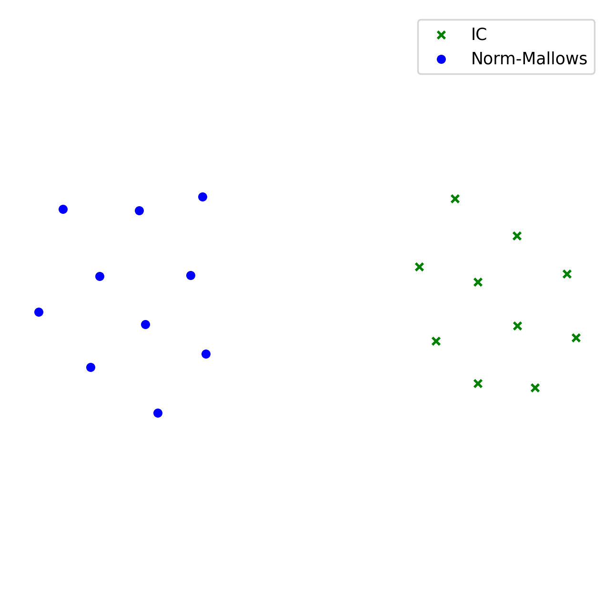
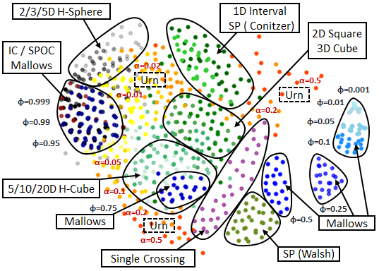

.. _quickstart:

Quick Start
===========

Import
------

To import mapof-elections python package:

.. code-block:: python

    import mapof.elections as mapof

General Tasks
-------------

.. _generate_ordinal_election:

Generate Ordinal Election from Statistical Culture
~~~~~~~~~~~~~~~~~~~~~~~~~~~~~~~~~~~~~~~~~~~~~~~~~~

.. admonition:: Objective

    Generate impartial culture election with 5 candidates and 50 voters.

In this section, you will learn how to generate ordinal elections from different statistical cultures. We will start by defining what we mean by an election.

Formally, an ordinal election is a pair :math:`E=(C,V)` that consists of a set of candidates :math:`C`
and a collection of voters :math:`V`, where each voter has a strict preference order (vote),
that is, each voter ranks all the candidates in :math:`C` from the most to the least desirable one.
We use terms voter and vote interchangeably.
In practice, we represent an ordinal election by ``OrdinalElection`` object, which among other fields, contains:

.. code-block:: python

    election.num_candidates     # number of candidates
    election.num_voters         # number of voters
    election.votes              # preference orders

By ``votes``, we refer to a two-dimensional array, where each row represents a single vote.

.. _example_oridnal_election:

.. rubric:: Example

E.g., ``votes = [[0,1,2,3],[2,0,3,1],[3,1,2,0]]`` refers to an election with three following votes:

::

    0 ≻ 1 ≻ 2 ≻ 3
    2 ≻ 0 ≻ 3 ≻ 1
    3 ≻ 1 ≻ 2 ≻ 0

To generate an election we use the ``generate_ordinal_election()`` function:

.. code-block:: python

    election = mapof.generate_ordinal_election(
                                        culture_id='impartial',
                                        num_candidates=5,
                                        num_voters=50)

.. _generate_approval_election:

Generate Approval Election from Statistical Culture
~~~~~~~~~~~~~~~~~~~~~~~~~~~~~~~~~~~~~~~~~~~~~~~~~~~

.. admonition:: Objective

    Generate impartial culture election with 20 candidates and 100 voters.

.. role:: python(code)
   :language: python

In this section, you will learn how to generate approval elections from different statistical cultures. We will start by defining what we mean by an election.

Formally, an approval election is a pair :math:`E=(C,V)` that consists of a set of candidates :math:`C` and a collection of voters :math:`V`, where each voter approves a certain subset of candidates. In practice, an ``ApprovalElection`` is an object that, among others, contains the following fields:

.. code-block:: python

   election.num_candidates     # number of candidates
   election.num_voters         # number of voters
   election.votes              # list of sets

By ``votes``, we refer to a list of sets, where each set represents a single vote.

.. _example_approval_election:

.. rubric:: Example

For example, ``votes = [{0,1},{1,2,3},{2}]`` refers to an election with three following votes:

.. centered::
   :math:`{0, 1}`,
   :math:`{1, 2, 3}`,
   :math:`{2}`.

..

To generate an election, we use the ``generate_approval_election()`` function:

.. code-block:: python

   election = mapof.generate_approval_election(
                                      culture_id='impartial',
                                      num_candidates=20,
                                      num_voters=100)

Generate Ordinal Election from Votes
~~~~~~~~~~~~~~~~~~~~~~~~~~~~~~~~~~~~

Instead of using a statistical culture, you can also generate elections based on your own votes using the :python:`generate_ordinal_election_from_votes` function.

.. code-block:: python

   votes = [[0, 1, 2, 3], [2, 0, 3, 1], [3, 1, 2, 0]]
   election = mapof.generate_ordinal_election_from_votes(votes)

Generate Approval Election from Votes
~~~~~~~~~~~~~~~~~~~~~~~~~~~~~~~~~~~~~

Instead of using a statistical culture, you can also generate elections based on your own votes using the :python:`generate_approval_election_from_votes` function.

.. code-block:: python

   votes = [{0, 1}, {1, 2, 3}, {2}]
   election = mapof.generate_approval_election_from_votes(votes)

Compute Borda Score
~~~~~~~~~~~~~~~~~~~

.. admonition:: Objective

    Compute Borda scores for a given ordinal election.

First, we need to create a ``scores`` list and fill it with zeros.

.. code-block:: python

   scores = [0 for _ in range(election.num_candidates)]

Second, we need to iterate through all the votes and add appropriate points to candidates.

.. code-block:: python

   for vote in election.votes:
       for c in range(election.num_candidates):
           scores[vote[c]] += election.num_candidates - 1 - c

The complete function looks as follows:

.. code-block:: python

   def compute_borda_scores(election) -> list:
       """ Returns list with all Borda scores """
       scores = [0 for _ in range(election.num_candidates)]
       for vote in election.votes:
           for c in range(election.num_candidates):
               scores[vote[c]] += election.num_candidates - 1 - c
       return scores

Compute Distance between Two Elections
~~~~~~~~~~~~~~~~~~~~~~~~~~~~~~~~~~~~~~

.. admonition:: Objective

    Compute the EMD-Positionwise distance between two ordinal elections.

To compute a distance, use the ``compute_distance`` function, which takes two elections and a ``distance_id`` as input.

.. code-block:: python

   distances, mapping = mapof.compute_distance(
                                       election_1,
                                       election_2,
                                       distance_id='emd-positionwise')

This function returns a tuple containing the distance and the mapping that witnesses this distance. If a given distance does not use a mapping, it returns ``None`` instead.

We start by generating two elections, and then we compute the distance:

.. code-block:: python

   election_1 = mapof.generate_ordinal_election(
                                           culture_id='impartial',
                                           num_voters=5,
                                           num_candidates=3)
   election_2 = mapof.generate_ordinal_election(
                                           culture_id='impartial',
                                           num_voters=5,
                                           num_candidates=3)
   distance, mapping = mapof.compute_distance(
                                           election_1,
                                           election_2,
                                           distance_id='emd-positionwise')

Computing distances between approval elections works in the same way.
A list of all implemented distances is available in :ref:`list_of_distances`.

.. _experiments:

Experiments
-----------

Generate Election as Part of Experiment
~~~~~~~~~~~~~~~~~~~~~~~~~~~~~~~~~~~~~~~

.. admonition:: Objective

    Generate (within experiment) impartial culture election with 5 candidates and 50 voters

In this section, we introduce an abstract object called ``Experiment``, which helps us keep things clear. Finally, we generate elections using the ``Experiment`` object.

An ``Experiment`` is an abstract object, which, for now, can be seen as a black box in which all the computation takes place. At first, it might be confusing, but in the long run, it simplifies things. Before carrying out any other operations we need to create an empty ``Experiment``. For this, we use the function ``prepare_online_ordinal_experiment()``, which returns an empty ``Experiment``. So, in order to prepare an empty ``Experiment``, type:

.. code-block:: python

    experiment = mapof.prepare_online_ordinal_experiment()

To give you a hint of what the ``Experiment`` is, we present some of its fields and methods:

.. code-block:: python

    experiment.elections
    experiment.distances
    experiment.coordinates
    experiment.features

    experiment.add_election()
    experiment.add_family()
    experiment.compute_distances()
    experiment.embed_2d()
    experiment.compute_feature()
    experiment.print_map_2d()

Now, we will focus on the ``add_election()`` method. In order to generate an election, it suffices to run the ``add_election()`` method, and specify the ``culture_id``. For example, if we want to generate an election from impartial culture, we type:

.. code-block:: python

    experiment.add_election(culture_id='impartial')

All elections added to the experiment are stored in an ``experiment.elections`` dictionary, where the key is the ``election_id``, and the value is the ``Election`` object. If you want to specify your own ``election_id``, you can do so using the ``election_id`` argument, for example:

.. code-block:: python

    experiment.add_election(culture_id='impartial', election_id='IC')

By default, the generated election will have 10 candidates and 100 voters. However, if you want to generate an election with a different number of candidates and voters, use the ``num_candidates`` and ``num_voters`` arguments:

.. code-block:: python

    experiment.add_election(culture_id='impartial',
                            num_candidates=5,
                            num_voters=50)

If you want to change the default values not for a single election, but for all elections generated in the future, type:

.. code-block:: python

    experiment.set_default_num_candidates(5)
    experiment.set_default_num_voters(50)

Our aim was to generate an impartial culture election (with 5 candidates and 50 voters) within the experiment. Below we present the code with the solution.

.. code-block:: python

    experiment = mapof.prepare_online_ordinal_experiment()
    experiment.add_election(culture_id='impartial',
                            num_candidates=5,
                            num_voters=50)

Generate Family of Elections
~~~~~~~~~~~~~~~~~~~~~~~~~~~~

.. admonition:: Objective

    Generate 20 elections from Normalized Mallows culture with norm-ϕ = 0.5

If you would like to add many elections from the same culture, instead of adding them one by one, you can add them as one family of elections.

.. code-block:: python

    experiment.add_family(culture_id='impartial', size=10)

The main difference between ``add_election`` and ``add_family`` is the fact that the latter function has an additional argument called size, which specifies how many elections from a given distribution will be created.

Moreover, note that instead of impartial culture, we want to generate Normalized Mallows elections, which are parameterized by norm-ϕ. To generate a single Normalized Mallows election with norm-ϕ = 0.5, we should type:

.. code-block:: python

    experiment.add_election(culture_id='norm-mallows', params={'normphi': 0.5})

Joining the upper two things together we obtain the solution.

.. code-block:: python

    experiment = mapof.prepare_online_ordinal_experiment()
    experiment.add_family(culture_id='norm-mallows', size=10, params={'normphi': 0.5})

You can also specify the name of you family using the 'family_id' argument.

.. code-block:: python

    experiment.add_family(culture_id='norm-mallows', size=10, params={'normphi': 0.5},
                          family_id='Norm-Mallows')

Then, the elections will be stored in the ``experiment.elections`` dictionary under the keys ``Norm-Mallows_0``, ``Norm-Mallows_2``, ... ,``Norm-Mallows_9``.

Create Map of Ordinal Elections
~~~~~~~~~~~~~~~~~~~~~~~~~~~~~~~

.. admonition:: Objective

    Create a map of elections (from impartial and Norm-Mallows cultures).

Creating a map of elections is an ultimate tool of this package. We divide the procedure into four major steps, which we describe in detail one by one, with the exception of the first step which was described before. The steps are the following:

1. Generate elections
2. Compute distances
3. Embed in 2D
4. Print the map

.. rubric:: Compute Distances

In order to compute distances between elections, use the following function:

.. code-block:: python

    experiment.compute_distances(distance_id='emd-positionwise')

The distances are stored in the ``distances`` field, which is a dictionary of dictionaries. If you want to access the distances, just type:

.. code-block:: python

    experiment.distances

**Example**

Let us assume that we have three elections generated from impartial culture with the following ids: ``ic_0, ic_1, ic_2``. Then, the ``distances`` (dictionary of dictionaries) look as follows:

.. code-block:: python

    {'ic_0': {'ic_1': 2.3, 'ic_2': 1.7},
     'ic_1': {'ic_0': 2.3, 'ic_2': 1.9},
     'ic_2': {'ic_0': 1.7, 'ic_1': 1.9}}

.. rubric:: Embedding

In order to embed the elections into 2D Euclidean space, run:

.. code-block:: python

    experiment.embed_2d(embedding_id='kk')

The coordinates are stored in the ``coordinates`` field, which is a dictionary of lists. If you want to access the coordinates, just type:

.. code-block:: python

    experiment.coordinates

More information about different embedding algorithms is available in TBU.

**Example**

Let us assume that we have four elections generated from Normalized Mallows culture with the following ids: ``mal_0, mal_1, mal_2, mal_3``. Then, the ``coordinates`` (dictionary of lists) look as follows:

.. code-block:: python

    {'mal_1': [0.2, 0.8],
     'mal_2': [0.4, 0.4],
     'mal_3': [0.3, 0.1],
     'mal_4': [0.9, 0.7]}

.. rubric:: Printing

In order to print the map, run:

.. code-block:: python

    experiment.print_map_2d()

.. _fig_ex_1:

.. figure:: img/examples/ex_1.png
    :width: 50%
    :align: center

    Example 1.

.. _fig_ex_2:

    Example 2.

After combining four steps described above we obtain the following code:

.. code-block:: python

    experiment = mapof.prepare_online_ordinal_experiment()
    experiment.add_family(culture_id='ic', size=10)
    experiment.add_family(culture_id='norm-mallows', size=10, params={'normphi': 0.5})
    experiment.compute_distances(distance_id='emd-positionwise')
    experiment.embed_2d(embedding_id='fr')
    experiment.print_map_2d()

As a result of the code above, you will see two separate black clouds of points (see :ref:`fig_ex_1`). In order to make the map more pleasing, we can specify the colors/markers/label of each election or family of elections separately. We do it via ``color``, ``marker``, ``label`` arguments.

Improved Solution:

.. code-block:: python

    experiment = mapof.prepare_online_ordinal_experiment()
    experiment.add_family(culture_id='impartial', size=10,
                                   color='green', marker='x', label='IC')
    experiment.add_family(culture_id='norm-mallows', size=10,
                                   params={'normphi': 0.5},
                                   color='blue', marker='o',
                                   label='Norm-Mallows')
    experiment.compute_distances(distance_id='emd-positionwise')
    experiment.embed_2d(embedding_id='fr')
    experiment.print_map_2d()

.. _fig_original:

    Example 3: A map for the 10x100 dataset of Szufa et al. [2020].

The picture created by the improved version is presented in :ref:`fig_ex_2`. Moreover, for illustrative purposes, in :ref:`Example 3 <fig_original>` we present the map for the 10x100 dataset of Szufa et al. [2020]. Note that the labels and arrows are created in PowerPoint and are not part of the mapof software.

.. rubric:: Compass
To be updated.

Create Map of Approval Elections
~~~~~~~~~~~~~~~~~~~~~~~~~~~~~~~~

Creating a map of approval elections works similarly to creating a map of ordinal elections. The only differences are the statistical cultures and distances used.

Coloring Map of Elections
~~~~~~~~~~~~~~~~~~~~~~~~~

It is interesting to color the map according to certain statistics, referred to as features.

.. rubric:: Basic

We offer several pre-implemented features. For example, if you would like to compute the highest plurality score for all elections, you can write:

.. code-block:: python

    experiment.compute_feature(feature_id='highest_plurality_score')

To print it, use the ``feature`` argument:

.. code-block:: python

    experiment.print_map_2d_colored_by_feature(feature_id='highest_plurality_score')

To access the computed values, type:

.. code-block:: python

    experiment.features['highest_plurality_score']

List of all the available features can be found in the :ref:`list_of_features`.

.. rubric:: Printing

Basic arguments for the ``print_map_2d`` function are the following:

.. code-block:: python

    saveas=str    # save file as xyz.png
    title=str     # title of the image
    legend=bool   # (by default True) if False then hide the legend
    ms=int        # (by default 20) size of the marker
    show=bool     # (by default True) if False then hide the map
    cmap          # cmap (only for printing features)

For example:

.. code-block:: python

    experiment.print_map_2d(title='My First Map', saveas='tmp', ms=30)

Offline Experiment
~~~~~~~~~~~~~~~~~~

Offline experiments are similar to online experiments but offer the possibility to export/import files with elections, distances, coordinates, features, etc.

.. rubric:: Prepare Experiment

To prepare an offline experiment, run:

.. code-block:: python

    experiment = mapof.prepare_offline_ordinal_experiment(
                            experiment_id='name_of_the_experiment')

The function above will create the experiment structure as follows:

.. code-block:: none

    experiment_id/
    ├── coordinates/
    ├── distances/
    ├── elections/
    ├── features/
    └── map.csv

.. rubric:: Prepare Elections

To prepare elections, run:

.. code-block:: python

    experiment.prepare_elections()

Elections are generated according to the `map.csv` file. An example `map.csv` file is created automatically when preparing the experiment.

All prepared elections are stored in the ``elections`` folder in a ``soc`` format. The definition of the ``soc`` format can be found at `Preflib <https://www.preflib.org/data/types#soc>`_.

.. rubric:: map.csv

The controlling `map.csv` file usually consists of:

- **size**: Number of elections to be generated from a given culture
- **num_candidates**: Number of candidates
- **num_voters**: Number of voters/votes
- **culture_id**: Code of the culture
- **params**: Dictionary with parameters of a given culture
- **family_id**: Family ID
- **label**: Label that will be printed in the legend
- **color**: Color of the point(s) on the map
- **alpha**: Transparency of the point(s)
- **marker**: Marker of the point(s)
- **ms**: Marker size
- **path**: Dictionary with parameters for generating a path of elections
- **show**: If False, the culture will not be displayed on the map

.. rubric:: Imports

If some parts of your experiment are already precomputed, you can import them while preparing the experiment. Ensure they are in the proper files. If they were precomputed using mapof, no additional steps are required.

If you want to import specific elements (different from default), specify them while preparing the experiment. For transparency, it is recommended to always define them.

.. code-block:: python

    experiment = mapof.prepare_offline_ordinal_experiment(
                            experiment_id='name_of_the_experiment',
                            distance_id="emd-positionwise",
                            embedding_id="kk")

Regarding features, if they are precomputed, the program will import them while printing the map.

Note that, if you will add new elections or families from the code, the map.csv file will be updated automatically.

For example if you will run the following code:

.. code-block:: python

    experiment = mapof.prepare_offline_ordinal_experiment(experiment_id='name_of_the_experiment')
    experiment.add_family(culture_id='impartial', size=10,
                                      num_candidates=20, num_voters=200,
                                   color='green', marker='s', label='IC')
    experiment.add_family(culture_id='urn', size=10,
                                   params={'alpha': 0.1},
                                      num_candidates=20, num_voters=200,
                                   color='blue', marker='o', label='Urn')

The map.csv file will look like this:

.. code-block:: python

    size;num_candidates;num_voters;culture_id;params;family_id;label;color;alpha;marker;ms;path;show
    10;20;200;impartial;{};impartial_10_100;IC;green;1.0;x;20;{};True
    10;20;200;urn;{};urn_10_100;Urn;blue;0.1;o;20;{};True

Other
~~~~~

.. rubric:: Own Cultures

If you want to add your own culture, you can do this by using the ``add_culture()`` function.

.. code-block:: python

    experiment.add_culture("my_name", my_func)

The function takes two arguments: The first one is the name of the new culture, and the second one is the function that generates the votes. The function that generates the votes can take any number of arguments, but among others, it must take ``num_candidates`` and ``num_voters`` parameters. Moreover, the function should return a numpy array with votes.

.. rubric:: Own Features

If you want to add your own feature, you can do this by using the ``add_feature()`` function.

.. code-block:: python

    experiment.add_feature("my_name", my_func)

The function takes two arguments: the first is the name of the new feature, and the second is the function that computes that feature. The function that computes the feature can take any number of arguments, but the first must be an election. Moreover, the function should return a dictionary (usually in the format ``{'value': value}``, but it can contain several keys, for example, ``{'value': value, 'std': std}``).

.. rubric:: Own Distances

If you want to add your own distance, you can do this by using the ``add_distance()`` function.

.. code-block:: python

    experiment.add_distance("my_name", my_func)

The function takes two arguments: the first is the name of the new distance, and the second is the function that computes that distance. The function that computes the distance can take any number of arguments, but the first two must be elections. Moreover, the function should return a pair (a float and a list). The first returned value is the distance, and the second is the mapping witnessing that distance; if the distance does not use a mapping, then it should return ``None`` instead.

.. rubric:: Remark

Functions that store data in files will overwrite the previous data when rerun. For example, if the elections are already created but the command ``mapof.prepare_elections()`` is executed again, the old elections will be overwritten. The same is true for other functions such as ``compute_distances()`` or ``embed_2d()``.

Map of Preferences (aka Microscope)
-----------------------------------

A *map of preferences* is similar to the map of elections; however, now each point represents a single voter (or candidate) instead of representing the whole election.

There are four possible microscopes that one can create: Ordinal-Voters, Ordinal-Candidates, Approval-Voters, and Approval-Candidates. In the following description, we mainly focus on the Ordinal-Voters variant. Given an election, we first have to compute the distances between the votes (``compute_distances()``). For that, we use the swap distance (optionally the Spearman distance). Next, we perform the embedding (``embed()``). Finally, we print the microscope (``print_map()``). For all these functions, we need to set the ``object_type`` argument, which can be set to either ``vote`` or ``candidate``. Below is the code that generates a microscope from scratch.

.. code-block:: python

    election = mapof.generate_ordinal_election(culture_id='norm-mallows',
                                               num_candidates=10,
                                               num_voters=100,
                                               normphi=0.4)

    election.compute_distances(distance_id='swap', object_type='vote')
    election.embed(object_type='vote')
    election.print_map(alpha=0.2, object_type='vote')

.. rubric:: Available Distances

.. list-table:: Available Distances
   :header-rows: 1

   * - Vote Type
     - Object Type
     - Distances
   * - Ordinal
     - vote
     - ``swap``, ``spearman``
   * - Ordinal
     - candidate
     - ``domination``, ``position``
   * - Approval
     - vote
     - ``hamming``, ``jaccard``
   * - Approval
     - candidate
     - ``hamming``, ``jaccard``

More details about the microscope can be found in the `Diversity, Agreement, and Polarization in Elections <https://doi.org/10.24963/ijcai.2023/299>`_ paper.
